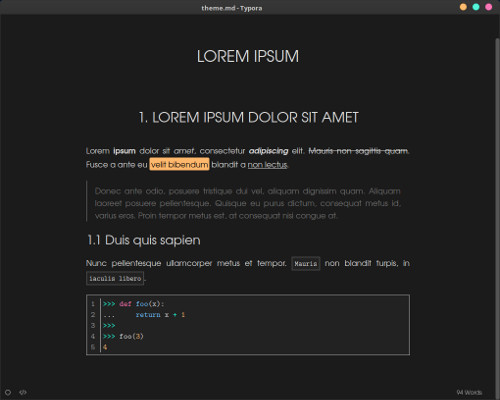
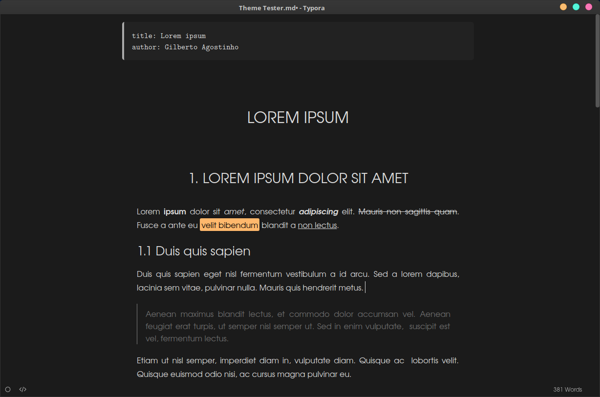
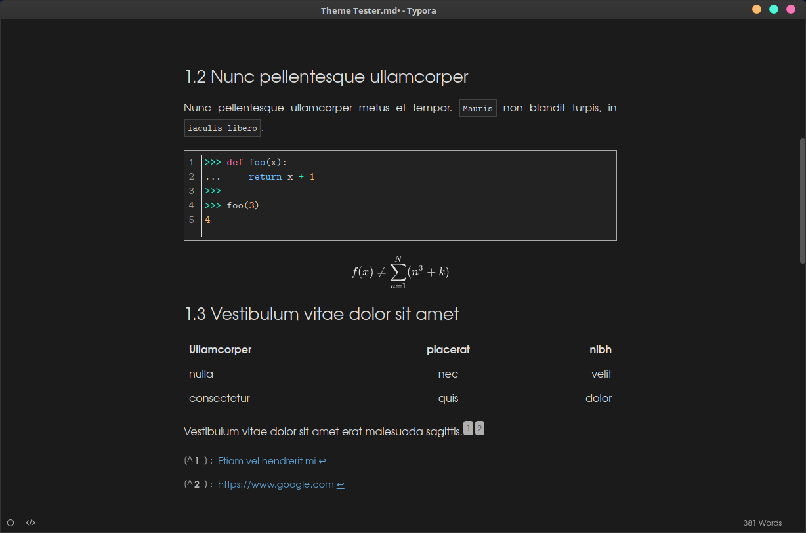
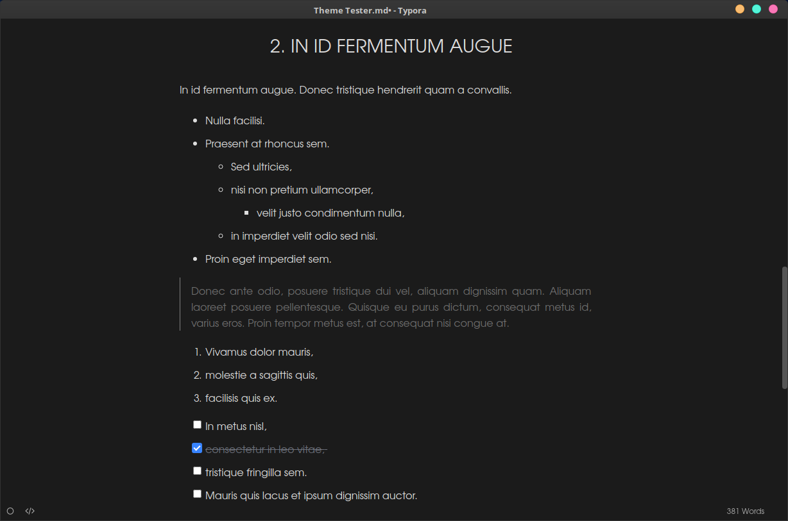
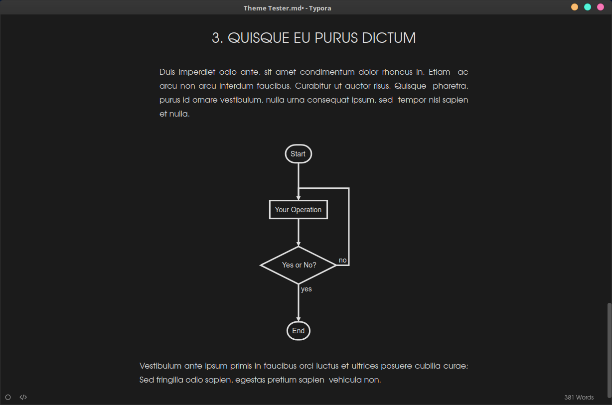
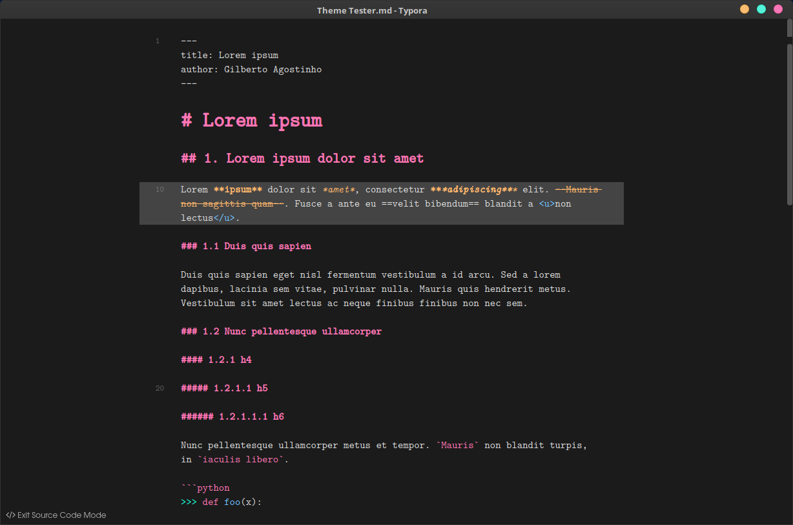

# Gothic Dark

Dark theme for Typora inspired by the [Gothic Theme](http://theme.typora.io/theme/Gothic/) for Typora (one of the [default themes](https://github.com/typora/typora-default-themes)).

## Install

* Download the theme package.
* Extract all the file under the `theme` folder to Typora's theme folder. Full instructions are available at [Typora's website](http://theme.typora.io/doc/Install-Theme/).
* Select `gothic-dark` theme in Typora.

## Screenshots

## Notes

* Tested in Linux Mint 18.3 and Typora 0.9.96 (beta). 
* Please report any issues with Windows and Mac.
